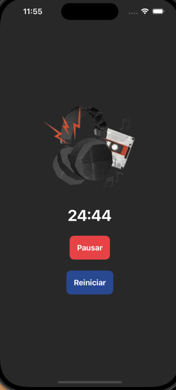
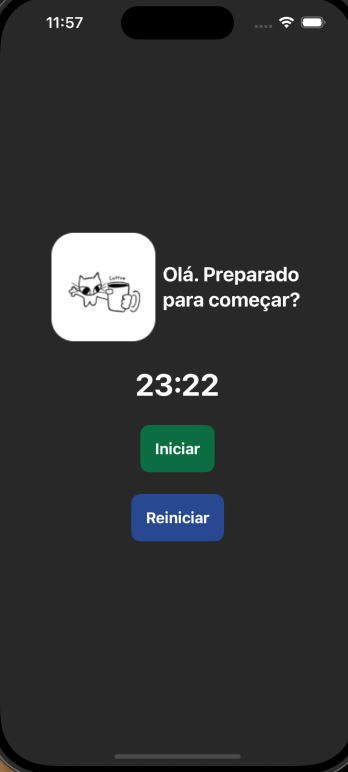
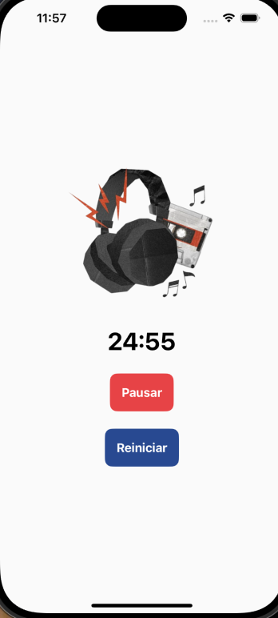

## Pomo

Um pomodoro simples, com implementação de timer e notificação, utilizando SwiftUI, Timer e AVKit. Essa pequena aplicação é um caso de estudo a parte para implementação de um projeto futuro.

### Objetivo

Entender mais o funcionamento do timer e notificações no ecossistema iOS, no geral.

### Funcionalidades 

- Iniciar, pausar e reiniciar um cronômetro de pomodoro.
- Notificação e alerta enviados ao acabar o tempo previsto.

### Screenshots

> Made in SwiftUI.
